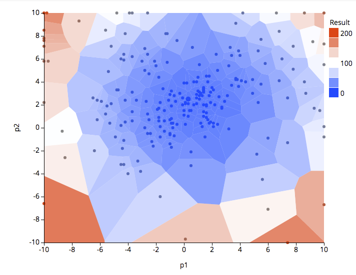

# A sample of optimzation of parameters

This is a sample of optimizing parameters using OACIS watcher.
This program iteratively search for parameters which minimizes the results of the simulations.
For the optimization, we adopted a [differential evolutiion algorithm](https://en.wikipedia.org/wiki/Differential_evolution).

## Prerequisites

Register simulator as follows.

- Name: "de_optimize_test"
- Parameter Definitions:
    - "p1", Float, 0.0
    - "p2", Float, 0.0
- Command:
    - `ruby -r json -e 'j=JSON.load(File.read("_input.json")); f=(j["p1"]-1.0)**2+(j["p2"]-2.0)**2; puts({"f"=>f}.to_json)' > _output.json`
- Input type: JSON
- Executable_on : localhost

The following command will register this simulator in your OACIS.

```
oacis_ruby prepare_simulator.rb
```

# What does this sample code do?

Search a pair of ("p1","p2") which minimizes the result of the simulations.

"ruby/de_optimizer.rb" is an optimization engine implementing a differential evolution algorithm. This is a generic routine independent of OACIS APIs.

"ruby/optimize_with_oacis.rb" combines OACIS and "de_optimizer.rb". It iteratively finds optimal parameters using the optimizer as a subroutine.

Similar codes written in Python are "python" directory. You can use either Ruby or Python version of the code.

# How to run

Specify the parameters for Differential Evolution algorithm as command line arguments.

```sh
oacis_ruby ruby/optimize_with_oacis.rb <num_iterations> <population size> <f> <cr> <seed>
```

For example, run the following.

```sh
oacis_ruby ruby/optimize_with_oacis.rb 10 20 0.8 0.9 1234
```

Or, if you prefer Python script, run

```sh
oacis_python python/optimize_with_oacis.py 10 20 0.8 0.9 1234
```

You can suspend the code by typing 'Ctrl-C'. Run the above command again to continue. The simulation runs already executed are stored in OACIS, and you can skip the simulation runs.

A scatter plot of the sampled parameters would look like the following. Color scale indicates the simulation outputs.
As you see in the figure, region close to the optimal point is more intensively sampled.



One of the simplest ways to apply this code to your simulator would be to fork this repository on github, and edit "optimize_with_oacis.rb" or "optimize_with_oacis.py" such that it matches the specification of your simulator.

# License

The MIT License (MIT)

Copyright (c) 2017 RIKEN, AICS

Permission is hereby granted, free of charge, to any person obtaining a copy of this software and associated documentation files (the "Software"), to deal in the Software without restriction, including without limitation the rights to use, copy, modify, merge, publish, distribute, sublicense, and/or sell copies of the Software, and to permit persons to whom the Software is furnished to do so, subject to the following conditions:

The above copyright notice and this permission notice shall be included in all copies or substantial portions of the Software.

THE SOFTWARE IS PROVIDED "AS IS", WITHOUT WARRANTY OF ANY KIND, EXPRESS OR IMPLIED, INCLUDING BUT NOT LIMITED TO THE WARRANTIES OF MERCHANTABILITY, FITNESS FOR A PARTICULAR PURPOSE AND NONINFRINGEMENT. IN NO EVENT SHALL THE AUTHORS OR COPYRIGHT HOLDERS BE LIABLE FOR ANY CLAIM, DAMAGES OR OTHER LIABILITY, WHETHER IN AN ACTION OF CONTRACT, TORT OR OTHERWISE, ARISING FROM, OUT OF OR IN CONNECTION WITH THE SOFTWARE OR THE USE OR OTHER DEALINGS IN THE SOFTWARE.

